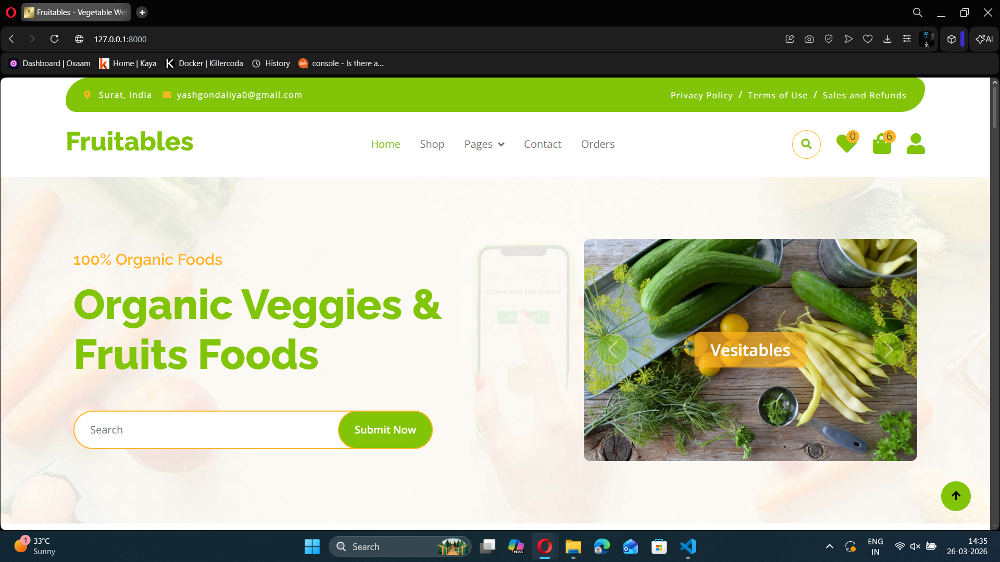
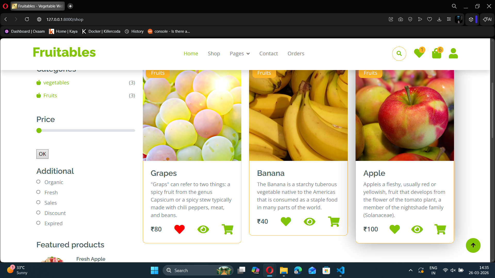
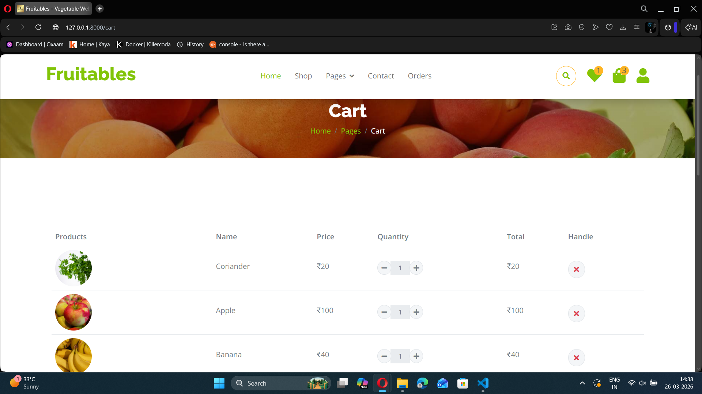
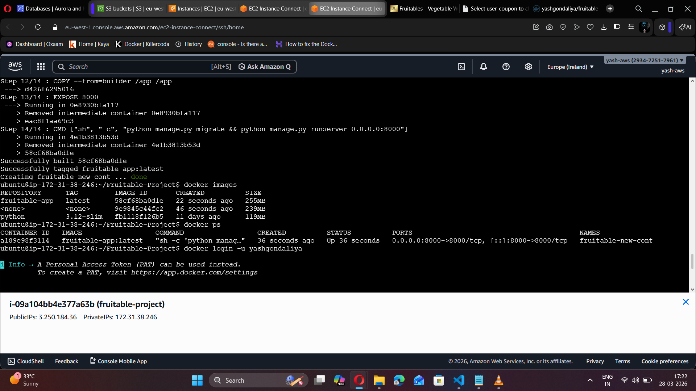

# 🛒 Fruitable - DevOps Enabled E-commerce Application

🚀 A full-stack Django-based e-commerce application built and deployed using modern **DevOps practices** including **Docker multi-stage builds**, **Docker Compose**, and **AWS cloud services**.

---

## 🌐 Architecture Overview

```id="arch001"
User → Browser → EC2 (Docker Compose)
                     │
                     ├── S3 (Static & Media Files)
                     └── RDS (Database)
```

---

## 🚀 Clone & Run Project

```bash id="clone001"
# Clone the repository
git clone https://github.com/yashgondaliy/Fruitable-Project.git

# Move into project directory
cd Fruitable-Project

# Run using Docker Compose
docker compose up -d
```

👉 Open in browser: http://localhost:8000

---

## ✨ Features

* 🔐 User Authentication (Login / Register)
* 🛍️ Product Listing & Shop System
* 🛒 Add to Cart & Checkout
* 📦 Order Management
* 📱 Responsive UI

---

## 🛠️ Tech Stack

### 👨‍💻 Application

* Backend: Django
* Frontend: HTML, CSS, JavaScript

### ⚙️ DevOps & Cloud

* Docker 🐳 (Multi-Stage Build)
* Docker Compose (Container Orchestration)
* AWS EC2 ☁️ (Deployment)
* AWS S3 (Static & Media Storage)
* AWS RDS (Database)
* AWS IAM (Access Control)
* Linux (Server Management)

---

## ⚙️ DevOps Implementation

* Built optimized images using **Docker multi-stage builds**
* Orchestrated services using **Docker Compose**
* Deployed containers on **AWS EC2**
* Configured **S3** for static and media file storage
* Integrated **RDS** with Django backend
* Implemented **IAM roles** for secure access
* Managed Linux server, networking, and debugging

---

## 🐳 Docker Setup

```bash id="docker001"
docker build -t fruitable-app .
docker run -d -p 8000:8000 fruitable-app
```

---

## 🧩 Docker Compose Setup

```bash id="compose001"
docker compose up -d
docker compose down
docker compose logs -f
```

---

## ☁️ AWS Deployment Steps

1. Launch EC2 instance
2. Install Docker & Docker Compose
3. Configure IAM role
4. Create S3 bucket for static/media
5. Setup RDS database
6. Configure environment variables
7. Run project using Docker Compose

---

## 📸 Screenshots

### 🏠 Homepage



### 🛍️ Shop Page



### 🛒 Cart Page



### 🐳 Docker Running



---

## 📂 Project Structure

```id="structure001"
Fruitable-Project/
│── myproject/              # Django project settings
│── myapp/                  # Main application
│── media/                  # Uploaded files
│── static/                 # Static files

│── Dockerfile              # Standard Docker build
│── Docker-multistage-file  # Multi-stage optimized Dockerfile
│── docker-compose.yml      # Container orchestration

│── requirements.txt
│── manage.py

│── .dockerignore
│── .gitignore

│── auto_push.sh            # Automation script
│── README.md
│── screenshots/            # Project images
```

---

## 🔐 Environment Variables

Create a `.env` file:

```env id="env001"
DEBUG=False
SECRET_KEY=your_secret_key

DB_NAME=your_db
DB_USER=your_user
DB_PASSWORD=your_password
DB_HOST=your_rds_endpoint

AWS_ACCESS_KEY_ID=your_key
AWS_SECRET_ACCESS_KEY=your_secret
AWS_STORAGE_BUCKET_NAME=your_bucket
```

---

## 🧠 Learning Outcomes

* Docker multi-stage optimization
* Docker Compose orchestration
* AWS deployment (EC2, S3, RDS, IAM)
* Linux server management
* Networking & debugging in production

---

## 🚀 Future Improvements

* CI/CD pipeline (GitHub Actions)
* Kubernetes deployment ☸️
* Load balancing & auto scaling
* Nginx + HTTPS

---

## 🔗 Repository

👉 https://github.com/yashgondaliy/Fruitable-Project

---

## 🙌 About Me

I am currently learning **DevOps Engineering** and building real-world cloud projects.

⭐ If you like this project, consider giving it a star!
